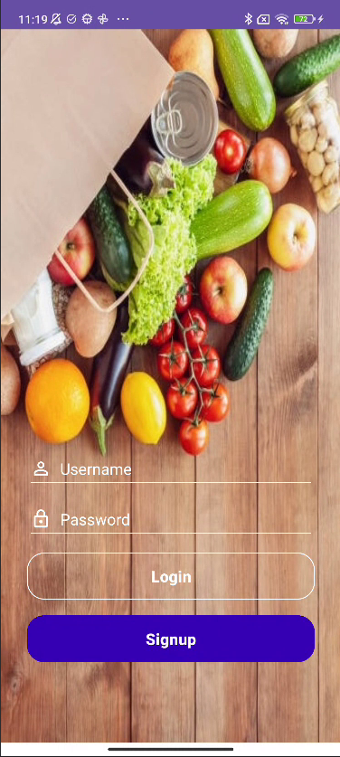
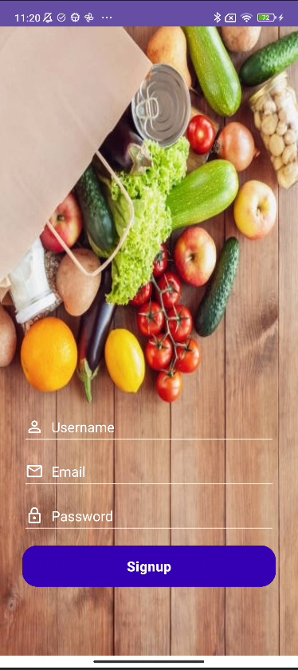
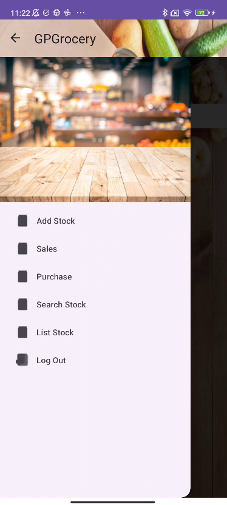
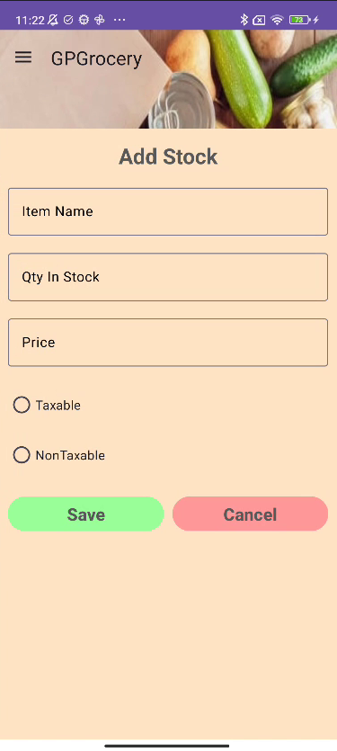

# Grocery App (In progress...)

A project developed as the final assignment for the Android Development Course I. This app is designed to serve as an efficient inventory management solution for grocery stores.

---

## Features

With the Grocery App, store managers can:

- **Manage Products**: Add, update, and delete product information.
- **Control Inventory**: Keep track of stock levels in real time.
- **Register Purchases**: Log purchase details to maintain accurate records.

---

## Purpose

The primary goal of the Grocery App is to streamline inventory management for grocery stores, making it easier to organize and oversee product availability while reducing manual effort.

---

## Technologies Used

- **Programming Language**: Java
- **Framework**: Android SDK
- **Database**: SQLite
- **UI Design**: Material Design principles

---

## Getting Started

1. Clone the repository to your local machine.
2. Open the project in Android Studio.
3. Build and run the app on an emulator or physical device.

---

## Screenshots

---

## Future Enhancements

- Implement the missing pages:
    - Homepage/Dashboard;
    - Sales Page;
    - Purchase Page;
    - Search Stock;
    - List Stock;
- Implement barcode scanning for easier product management.
- Integrate analytics to provide insights into sales and inventory trends (Dashboard).

---
