<div align="center">

# Crate

**A till and stock app for small grocery stores, built with Kotlin and Jetpack Compose.**

Ring up sales, weigh produce, take in deliveries, count the shelves and see how
the week is going, on one phone, offline, behind a PIN.

[Features](#features) · [Screenshots](#screenshots) · [Run it](#run-it) · [Architecture](#architecture) · [Tests](#tests)

</div>

---

<div align="center">
  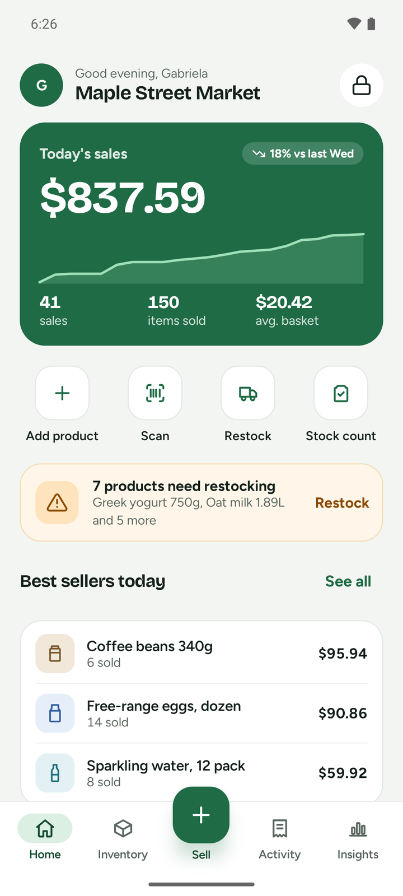
  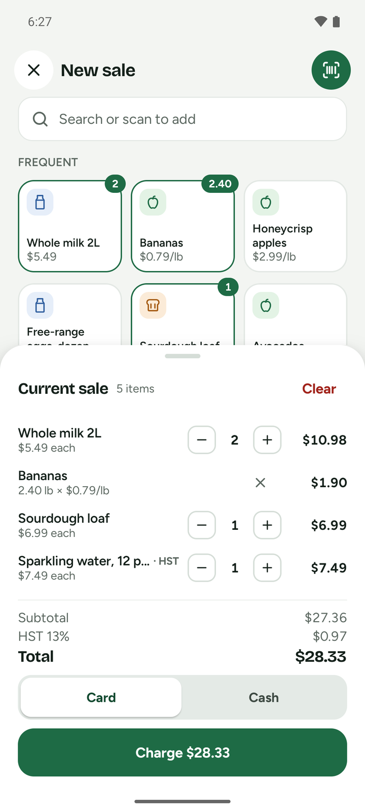
  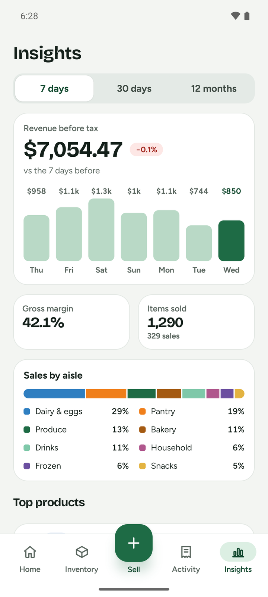
</div>

## What this is

Crate is for the owner of a corner store or a small grocer: one phone at the
counter that works as the till, the stock book and the sales report.

It started as GroceryApp, the final assignment for an Android development
course: a Java app with SQLite, sign-up and login screens and a form to add
stock. It has since been rebuilt from scratch as a portfolio piece, in Kotlin
and Jetpack Compose, with a design system of its own. The screens were drawn as
mockups first and then built to match.

There is no account and no server. The store lives on the phone, a four-digit
PIN locks it, and a sample store with five weeks of sales lets you try every
screen straight away.

## Features

**Selling**
- A new sale starts with the store's most frequent products one tap away;
  anything else is a search or a barcode scan
- Weighed produce asks for the weight (kg or lb) and prices it to the cent.
  Counted products get + and − steppers
- HST is worked out once on the taxable total, the way a till does it, and
  zero-rated groceries are left alone
- Card or cash, with the change due shown as the cash received is typed
- A receipt to share, which keeps the tax rate it was charged at, and a nudge
  to restock anything the sale left running low
- Leaving a sale that still has products in it asks first

**Stock**
- Inventory with search (case and accents do not matter), filters for low
  stock, out of stock and each aisle, and the stock's value at cost
- Swipe a product to count it; the count becomes the stock on hand
- A product page with price, cost and margin, a stock gauge against its alert
  level and the last seven days of sales
- Add or edit a product: a photo from the camera or gallery, a barcode by scan,
  sold each or by kg or lb, taxable or zero-rated, and its supplier
- Scanning a barcode the store does not know offers to add it as a new product
- Restock: choose the supplier and their low products are filled in, with
  enough to bring each shelf back to twice its alert level. Receiving the
  delivery adds the stock and updates the cost

**Knowing how the store is doing**
- Home: today's sales against the same weekday last week, the day's takings
  as a line, quick actions, what needs restocking and today's best sellers
- Activity: every sale and delivery from the last 30 days, grouped by day
- Insights for 7 days, 30 days or 12 months: revenue before tax against the
  period before, gross margin, items sold, sales by aisle and the top products
- Sales and products export as CSV for the accountant or a spreadsheet

**Looking after the till**
- A four-digit PIN, kept only as a salted PBKDF2 hash. Five wrong tries in a
  row pause the lock screen for 30 seconds
- Unlock with a fingerprint or face where the phone has one set up
- The till locks itself after five minutes out of sight
- Light and dark themes, following the phone or set by hand

## Screenshots

<table>
  <tr>
    <td align="center"><br><sub>Home</sub></td>
    <td align="center"><br><sub>New sale</sub></td>
    <td align="center">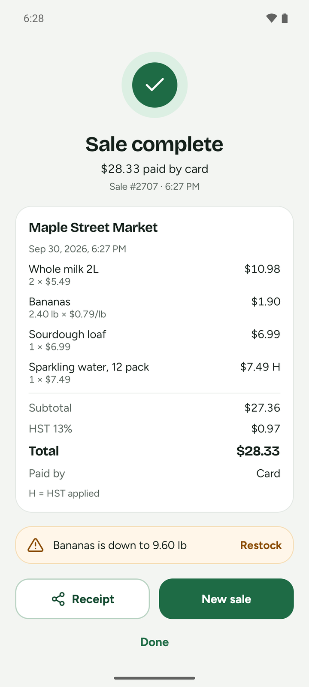<br><sub>Sale complete</sub></td>
  </tr>
  <tr>
    <td align="center">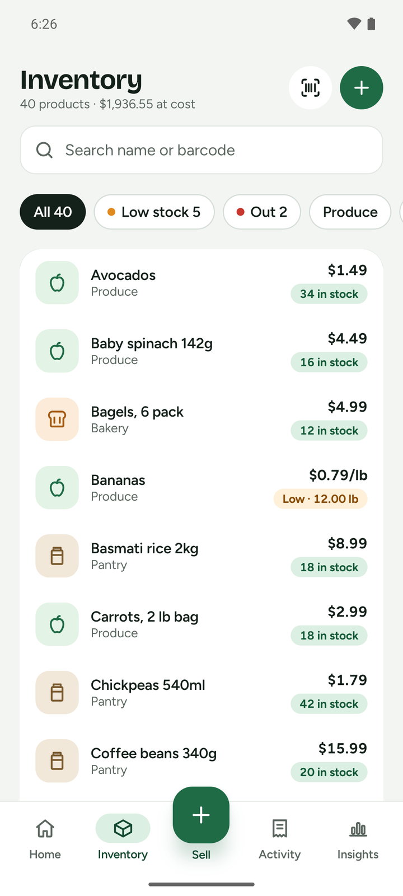<br><sub>Inventory</sub></td>
    <td align="center">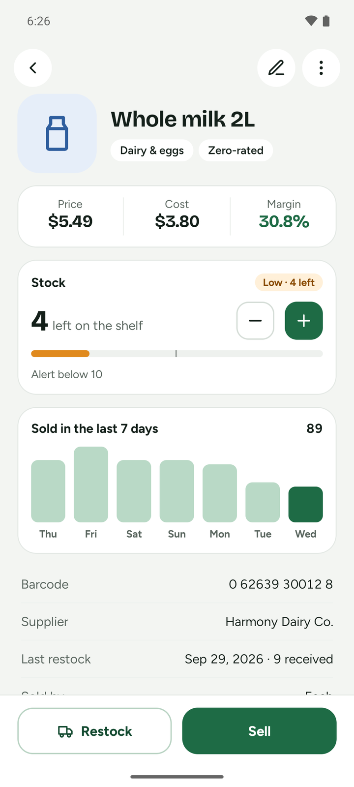<br><sub>Product</sub></td>
    <td align="center">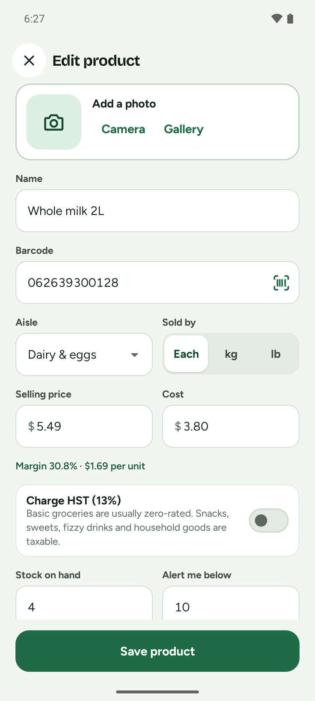<br><sub>Edit product</sub></td>
  </tr>
  <tr>
    <td align="center">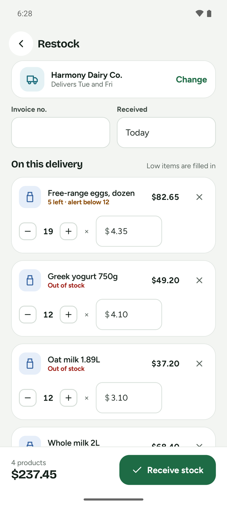<br><sub>Restock</sub></td>
    <td align="center">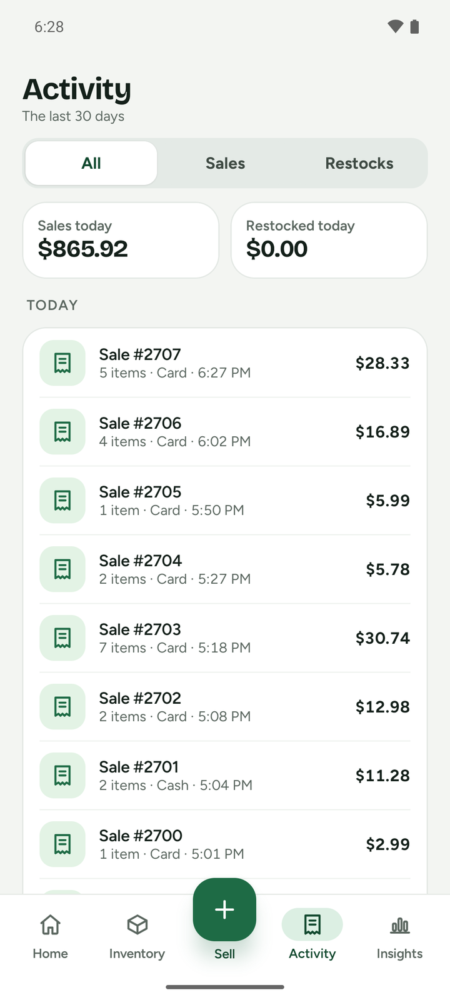<br><sub>Activity</sub></td>
    <td align="center"><br><sub>Insights</sub></td>
  </tr>
  <tr>
    <td align="center">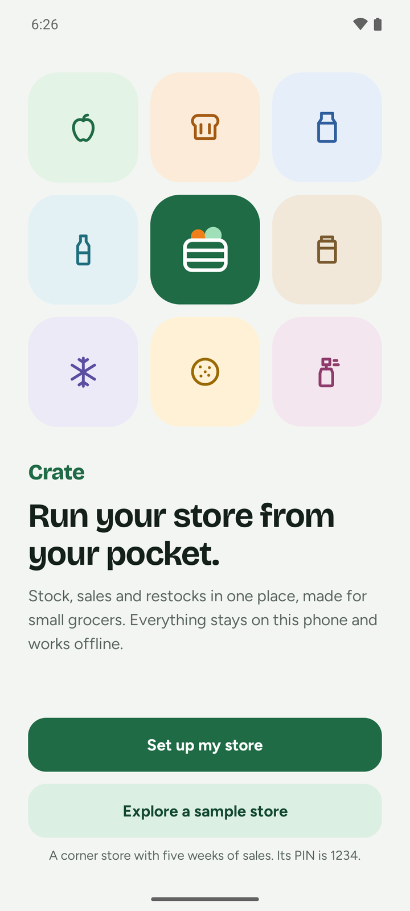<br><sub>Welcome</sub></td>
    <td align="center">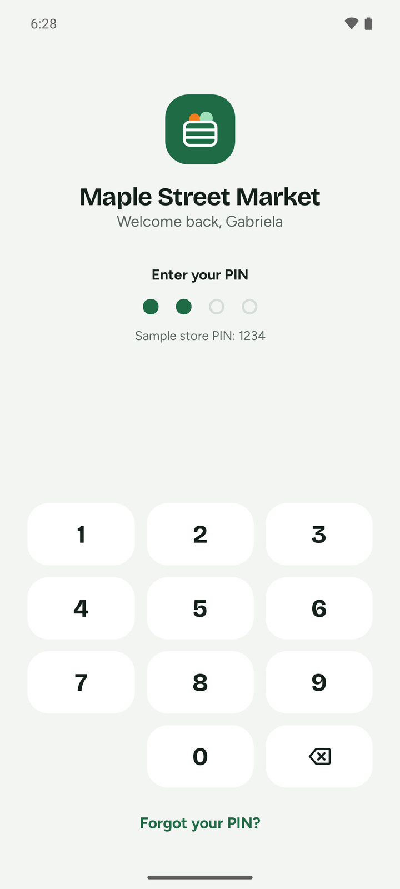<br><sub>Unlock</sub></td>
    <td align="center">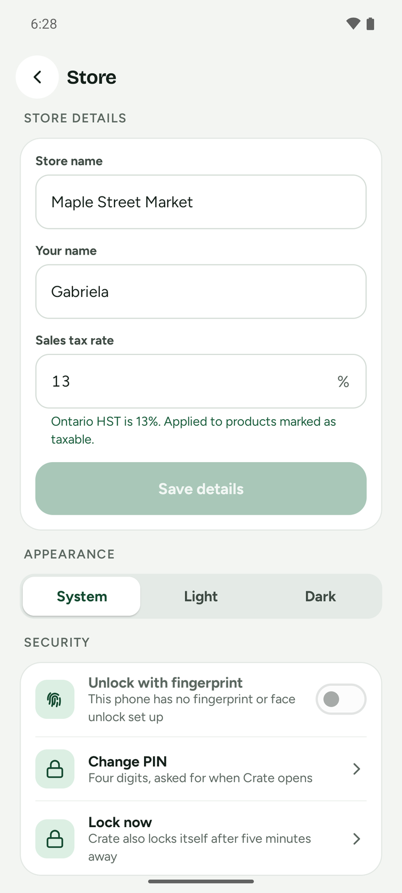<br><sub>Settings</sub></td>
  </tr>
</table>

**Dark mode**

<table>
  <tr>
    <td align="center">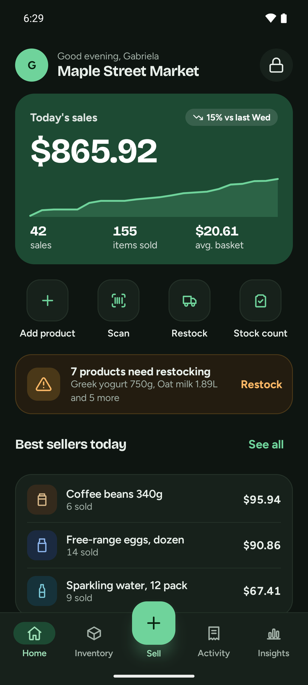<br><sub>Home</sub></td>
    <td align="center">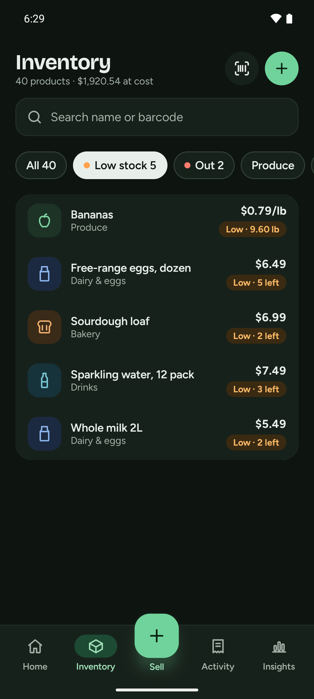<br><sub>Inventory</sub></td>
    <td align="center">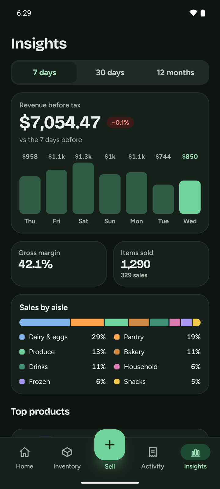<br><sub>Insights</sub></td>
  </tr>
</table>

## Design

- **Colour.** Basil green for the things to do and tangerine for what needs
  attention. Red is kept for out of stock, drops and anything that cannot be
  undone. Each aisle has its own soft colour, used on product tiles and in the
  charts. Dark mode has a palette of its own rather than inverted colours.
- **Type.** [Bricolage Grotesque](https://fonts.google.com/specimen/Bricolage+Grotesque)
  for headings and the big numbers, with its optical size set for each role,
  and [Figtree](https://fonts.google.com/specimen/Figtree) for everything else.
  Prices use tabular figures so they line up in columns.
- **Icons.** One set of line icons in a single stroke weight, drawn in the app
  as vectors, with one for each aisle.
- **Accessibility.** Icon buttons and charts have spoken descriptions, touch
  targets meet the 48 dp minimum, headings are marked as headings, and
  swipe-to-count is also offered as an accessibility action.

## Tech stack

- **Kotlin 2.4** and **Jetpack Compose** with Material 3
- Built with the **Android Gradle Plugin 9** and **Gradle 9**
- **Navigation Compose** with type-safe routes
- **ViewModel** and **StateFlow**, collected with lifecycle awareness
- **Room** (with KSP) for the store, **DataStore** for settings and the PIN hash
- **Biometric** prompt, **ML Kit code scanner** (Google Play services), the
  system photo picker and **FileProvider** for sharing
- **Coil** for product photos and **Core SplashScreen**
- **JUnit 4** tests on the JVM
- **GitHub Actions** runs the unit tests and lint and builds a debug APK on
  every push

## Run it

You need an Android Studio recent enough for the Android Gradle Plugin 9.4, or JDK
17 or newer with the Android SDK 37. The app runs on Android 10 (API 29) and up,
and targets Android 17 (API 37).

```bash
git clone https://github.com/gabrielapereira15/GroceryApp.git
cd GroceryApp
./gradlew installDebug      # with a device or emulator connected
```

Or open the folder in Android Studio and press Run.

On the welcome screen, **Explore a sample store** opens Maple Street Market,
a corner store with 40 products and five weeks of sales. Its PIN is `1234`.
**Set up my store** starts an empty store of your own.

Barcode scanning uses Google's code scanner from Play services, so on an
emulator pick a system image with Google Play.

### Commands

```bash
./gradlew testDebugUnitTest   # unit tests
./gradlew lintDebug           # Android lint
./gradlew assembleDebug       # app/build/outputs/apk/debug/app-debug.apk
```

## Architecture

```
app/src/main/java/com/example/gpgrocery/
├── domain/          Money, quantities, cart and tax maths, insights, CSV, PIN hashing
├── data/
│   ├── db/          Room entities, DAOs and the database
│   ├── settings/    Store details, preferences and the PIN, in DataStore
│   ├── sample/      Generates the sample store
│   ├── photos/      Product photos, kept in the app's own storage
│   └── Repositories.kt
├── ui/
│   ├── theme/       Colours, type, shapes and icons
│   ├── components/  Buttons, cards, inputs, charts, the bottom bar
│   ├── navigation/  Routes and the nav host
│   └── home/ inventory/ product/ sale/ restock/ activity/ insights/
│       settings/ onboarding/ unlock/
├── AppContainer.kt  Builds the repositories once for the whole app
└── MainActivity.kt
```

- One activity, with Compose everywhere. Each screen has a ViewModel that
  exposes a single state object as a `StateFlow`.
- Dependencies are passed by hand from `AppContainer`, which is small enough
  that a DI framework would add more than it saves.
- **No floating point in money.** Amounts are whole cents in a `Long`,
  quantities are thousandths of a unit (2.40 lb is 2400) and the tax rate is in
  basis points (13% is 1300). Rounding happens once, half up, in `Pricing`.
- A sale is written in one database transaction: the next receipt number, the
  lines and the stock taken off the shelf.
- Sale lines keep a copy of the product's name, price, cost and tax status at
  the time of sale, so history and margins stay right after a product changes
  or is deleted.
- The lock is a `Session` held in memory, so a restart always asks for the
  PIN. The store's screens keep their place while it is locked.
- The code in `domain/` has no Android dependencies, so its tests run on the
  JVM without an emulator.

## Tests

```bash
./gradlew testDebugUnitTest
```

58 unit tests cover:

- money parsing and formatting, weighed quantities, line totals and HST
  rounding, including the $28.33 receipt from the design mockups
- cart totals, item counts and change for cash
- PIN hashing, and the pause after five wrong PINs in a row, on a real
  DataStore
- the automatic lock after five minutes away
- the insights windows, the daily and monthly bars, and how aisles and
  products are ranked
- the product form: what a blank field means, and what is not a valid price
  or quantity
- barcode clean-up and check digits, and CSV quoting

## Known gaps

- One phone, one store. There is no sync and, on purpose, no Android backup,
  so the data and the PIN never leave the phone. The CSV exports are the way
  to get data out, and there is no import.
- A forgotten PIN cannot be recovered. The only way back in is to erase the
  store and start again.
- Card payments are recorded, not taken. There is no payment terminal,
  receipt printer or cash drawer.
- A sale cannot be refunded or edited once it is charged.
- One sales tax rate, set up for Ontario's HST. Provinces that charge GST and
  PST separately would need two.
- English only, with amounts formatted for Canada.

## Credits

Originally the final assignment for the Android Development I course, then
rebuilt as a portfolio piece.

Typefaces: Bricolage Grotesque and Figtree, both under the SIL Open Font
License 1.1 (see `app/licenses/`).

## Licence

[MIT](LICENSE) © Gabriela Nascimento Oliveira Pereira
